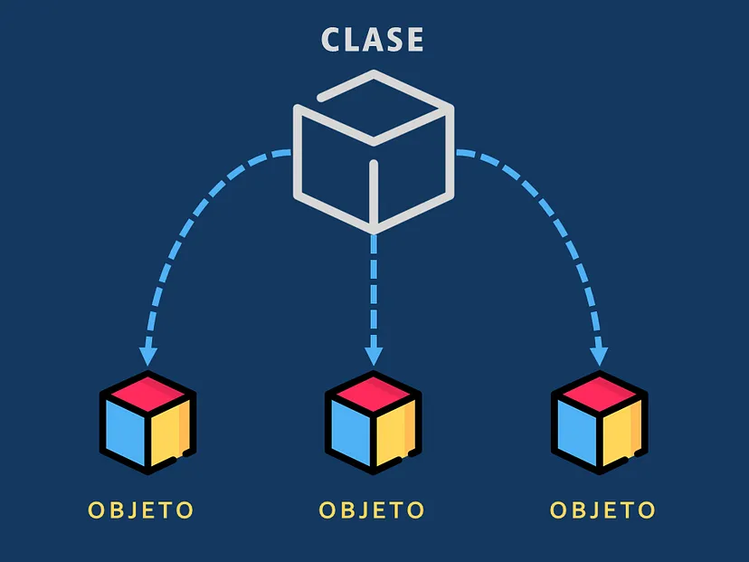

# Solucionario de Actividades del Paralelo 2 de POO en el PAO 1 - 2024

Bienvenido al repositorio de soluciones para las actividades del Paralelo 2 de Programación Orientada a Objetos (POO) en el PAO 1 - 2024. Este repositorio tiene como objetivo proporcionar una guía para las soluciones de las actividades realizadas durante el curso.

## Importante

Las soluciones presentadas aquí no son únicas. Existen múltiples maneras de resolver los problemas planteados en las actividades. Este repositorio debe ser utilizado como una guía de estudio y no como una fuente para copiar y pegar en futuras actividades. Se recomienda encarecidamente que utilices estas soluciones para comprender mejor los conceptos y desarrollar tus propias soluciones.

## Secciones del Repositorio
-[Tareas](https://github.com/robtrivi/actividades-poo-p02/tree/main/tareas)
-[Talleres](#)
---

Para cualquier consulta o sugerencia, por favor, no dudes en abrir un [issue](https://github.com/robtrivi/actividades-poo-p02/issues) o enviar un [pull request](https://github.com/robtrivi/actividades-poo-p02/pulls).
